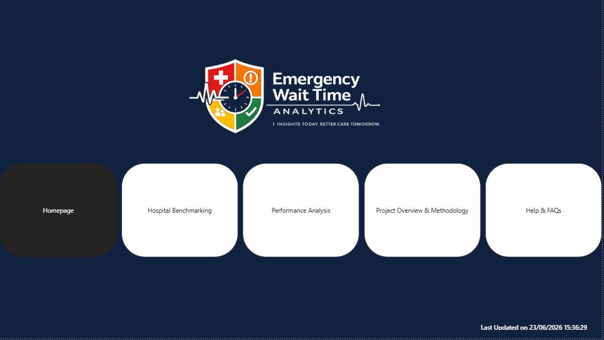
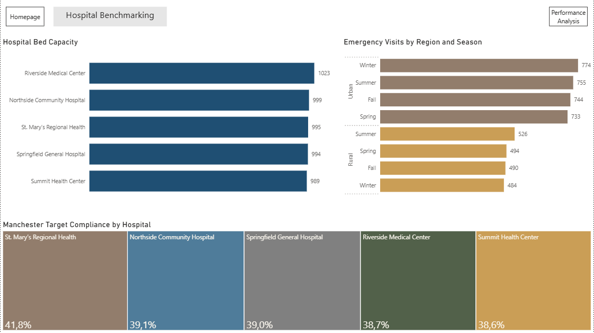
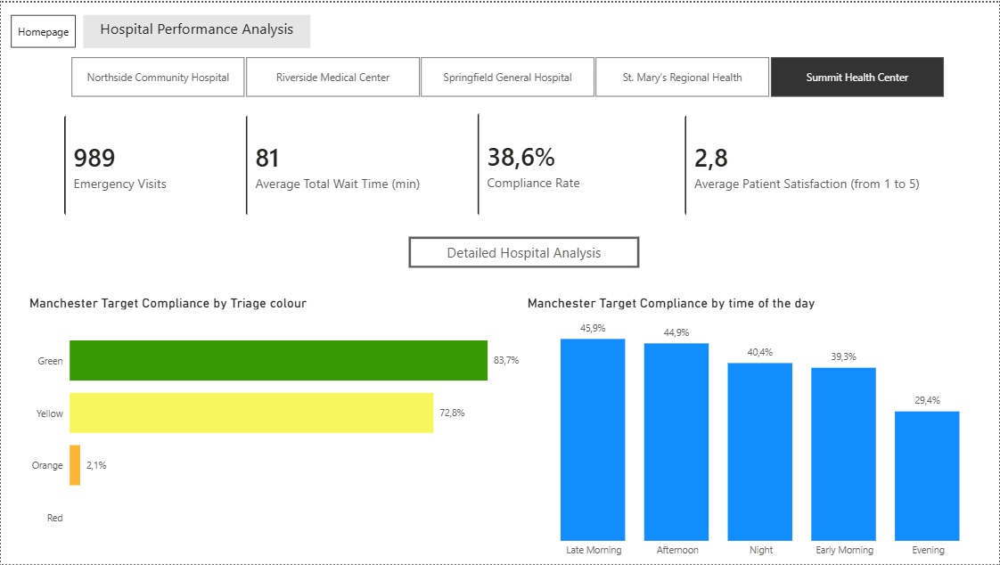
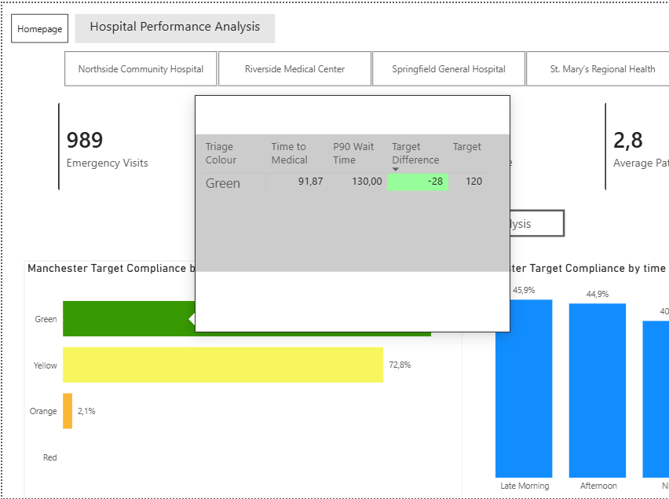
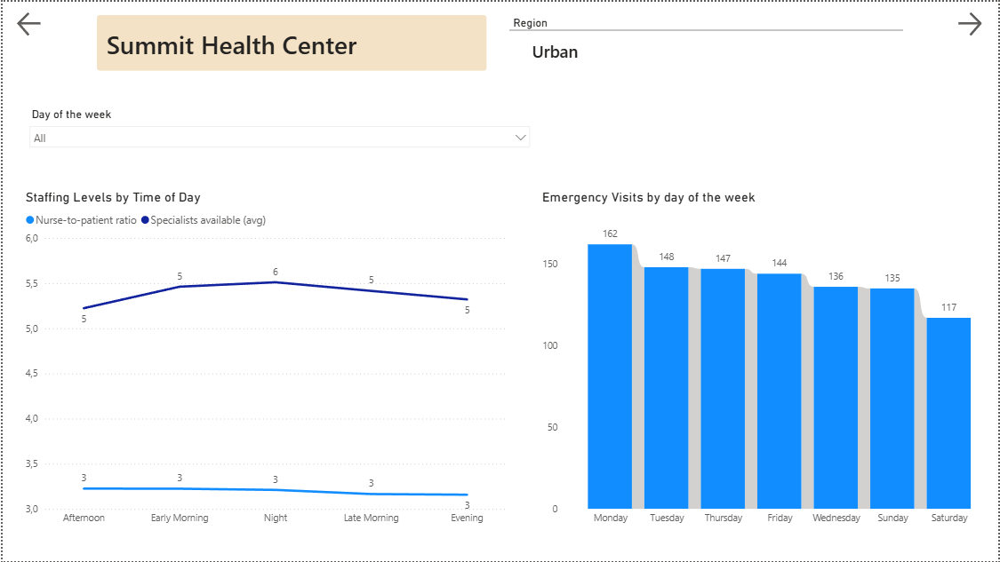
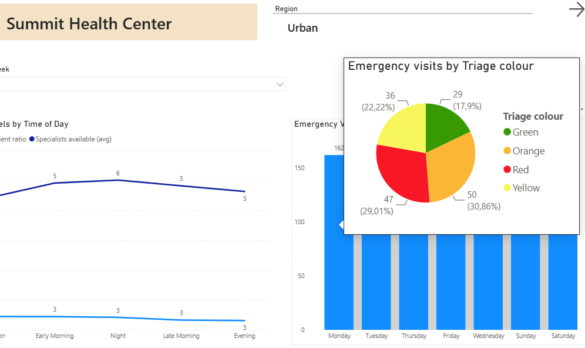
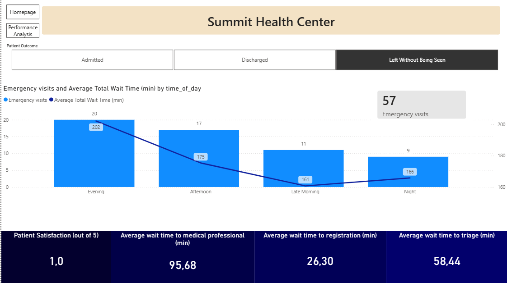
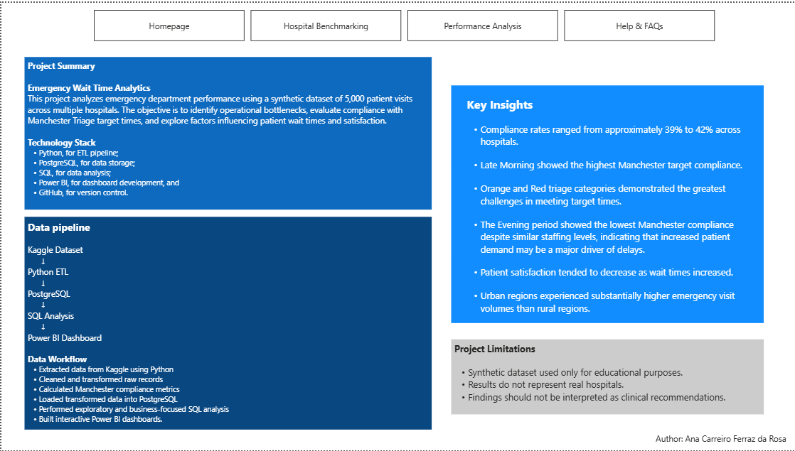
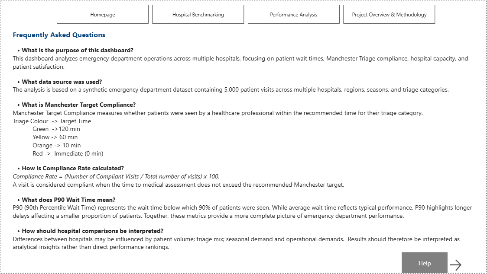
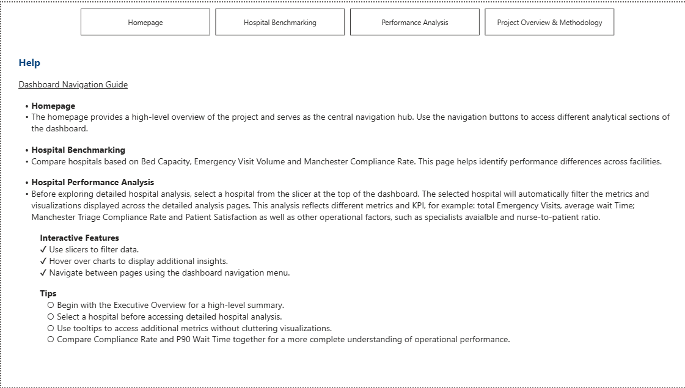

# Emergency Wait Time Analytics

An end-to-end healthcare analytics project exploring emergency department performance using Python, PostgreSQL, SQL, and Power BI.

## Project Highlights

* 5 Hospitals
* 5000 Emergency Department Visits
* Python ETL Pipeline
* PostgreSQL Database
* SQL Analysis
* Interactive Power BI Dashboard
* Hospital performance analysis, including Manchester Triage Compliance

---

## Project Overview

Emergency Wait Time Analytics is an end-to-end healthcare analytics project designed to evaluate emergency department performance across multiple hospitals.

The project focuses on:

* Patient wait times
* Manchester Triage compliance
* Hospital capacity
* Operational performance
* Patient satisfaction

The objective is to identify operational patterns, evaluate compliance with recommended triage target times using the Manchester Triage Protocol, and provide actionable insights into emergency department performance.

---

## Business Objectives

* Analyze emergency department wait times
* Evaluate Manchester Triage compliance
* Compare performance across hospitals
* Identify operational bottlenecks
* Explore demand patterns across regions, seasons and times of the day
* Assess the impact of staffing and specialist availability on performance

---

## Technology Stack

| Technology | Purpose               |
| ---------- | --------------------- |
| Python     | ETL Pipeline          |
| PostgreSQL | Data Storage          |
| SQL        | Data Analysis         |
| Power BI   | Dashboard Development |
| GitHub     | Version Control       |

---

## Project Architecture

```text
Kaggle Dataset
      ↓
Python ETL Pipeline
      ↓
PostgreSQL Database
      ↓
SQL Analysis
      ↓
Power BI Dashboard
```
## Data Source

This project uses the **ER Wait Time** dataset available on Kaggle.

Dataset:
https://www.kaggle.com/datasets/rivalytics/er-wait-time

The dataset contains 5000 synthetic emergency department visits across multiple hospitals and includes patient demographics, wait times, triage categories, staffing indicators, patient outcomes, and patient satisfaction metrics.

Author: rivalytics
Platform: Kaggle

## ETL Process

The ETL pipeline was developed in Python and included:

* Data extraction from Kaggle
* Data cleaning and transformation
* Standardization of column names
* Creation of Manchester Triage target metrics
* Compliance classification (Compliant / Non-Compliant)
* Generation of operational KPIs
* Loading transformed data into PostgreSQL

---

## Dashboard Pages

### Homepage

Project introduction and navigation hub.

### Hospital Benchmarking

Comparison of hospitals based on capacity, demand, and compliance.

### Hospital Performance Analysis

Exploration of staffing levels, patient volume, and operational performance.

### Project Overview & Methodology

Project methodology, architecture, and key findings.

### Help & FAQs

Dashboard guidance and metric definitions.

---
## Dashboard Preview

The interactive Power BI dashboard consists of six main sections:

Homepage
Hospital Benchmarking
Hospital Performance Analysis
Operational Analysis
Project Overview
Help & FAQs

### Homepage



### Hospital Benchmarking



### Hospital Performance Analysis - Overview



### Hospital Performance Analysis - Tooltip Example



### Operational Analysis



### Operational Analysis - Tooltip Example



### Additional Operational Analysis



### Project Overview & Methodology



### Frequently Asked Questions



### Help & Navigation Guide



---
## Key Insights

* Compliance rates ranged from approximately 39% to 42% across hospitals.
* Evening periods experienced the highest patient volume and the lowest compliance rates. Despite variations in demand throughout the day, staffing indicators remained relatively stable, suggesting that increased patient volume may have a greater impact on performance than workforce availability.
* Increased patient demand appears to have a greater impact on performance than workforce availability.
* Compliance varied significantly across Manchester Triage categories.
* Urban regions experienced substantially higher emergency visit volumes than rural regions.

---

## Disclaimer

This project uses a synthetic healthcare dataset for educational and portfolio purposes. Results do not represent real hospitals, patients, or healthcare systems.

---

## About the Author

**Ana Carreiro Ferraz da Rosa**

Cardiac Physiologist with postgraduate training in Health Data Science, passionate about healthcare analytics, clinical informatics, and data-driven decision making.

This project combines clinical domain knowledge with modern data analytics tools to explore operational performance in emergency healthcare settings.
